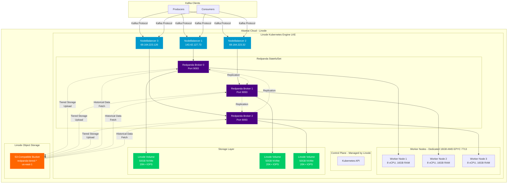
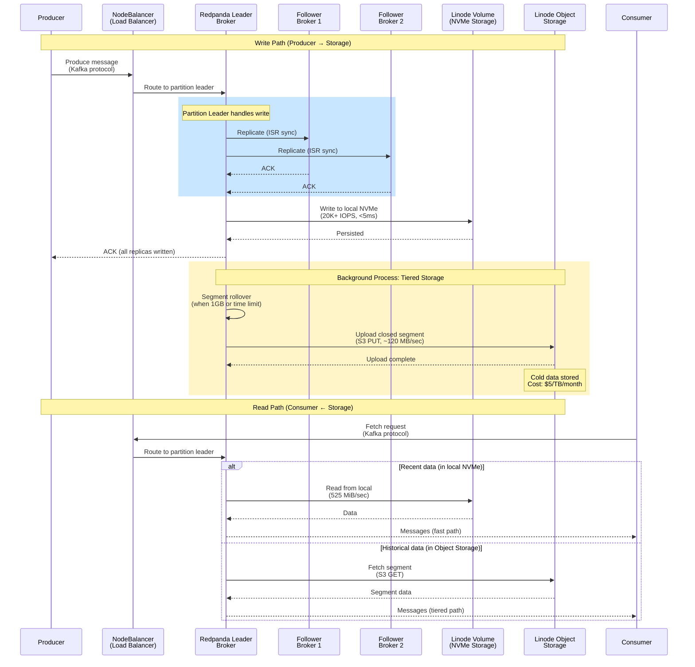
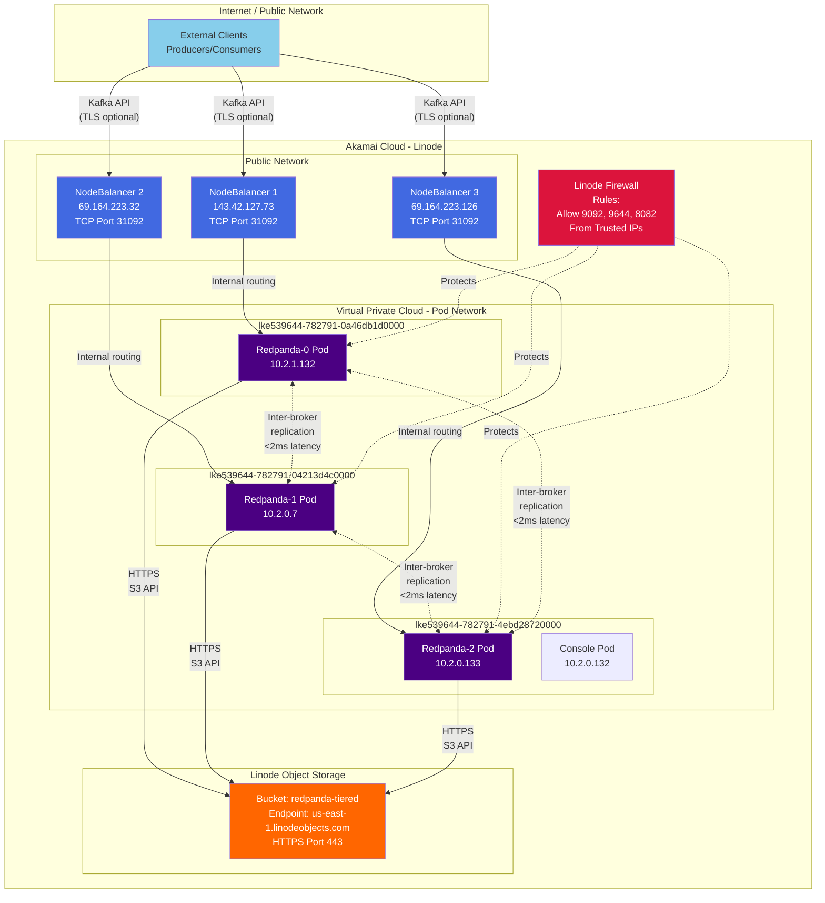
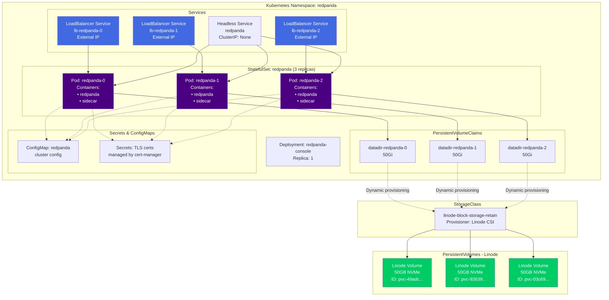
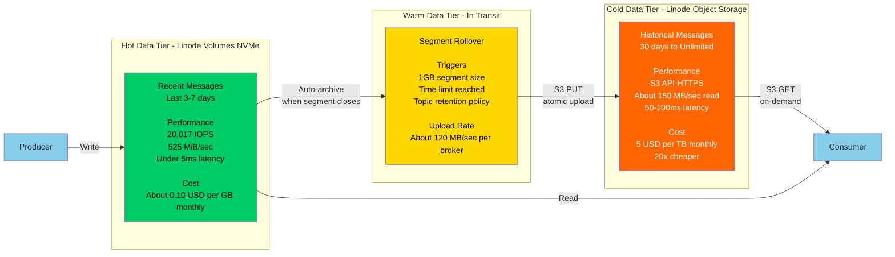
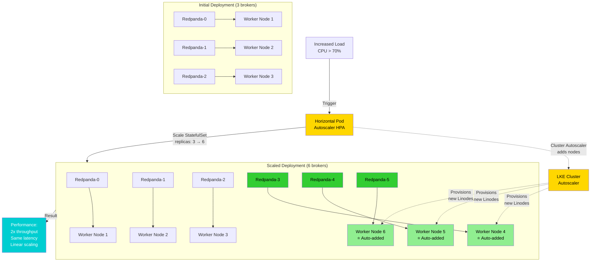
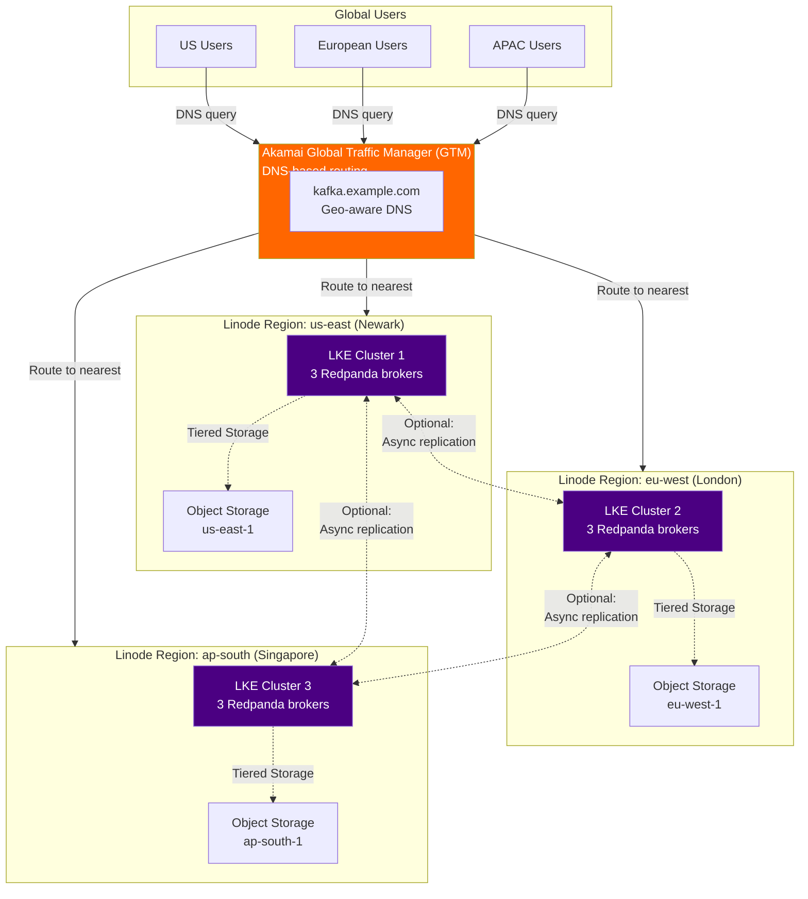

```mermaid
graph LR
    A[Start] --> B{Infrastructure<br/>Exists?}

    B -->|No| C[Terraform Apply<br/>~3 minutes]
    B -->|Yes| E

    C --> D[LKE Cluster Created<br/>3 worker nodes<br/>Object Storage bucket]

    D --> E[Wait for Nodes Ready<br/>~1-2 minutes]

    E --> F[Helm Install Redpanda<br/>~5-10 minutes]

    F --> G[Wait for Pods Running<br/>~2-3 minutes]

    G --> H[Configure Tiered Storage<br/>~1 minute]

    H --> I{Validation<br/>Required?}

    I -->|Yes| J[Run Self-Tests<br/>~10 minutes]
    I -->|No| M

    J --> K{All Tests<br/>Passed?}

    K -->|Yes| M[Production Ready!]
    K -->|No| L[Review Logs<br/>Troubleshoot]

    L --> F

    M --> N[Access via<br/>NodeBalancer IPs]

    style C fill:#4169E1,color:#fff
    style F fill:#4B0082,color:#fff
    style J fill:#32CD32,color:#000
    style M fill:#00CED1,color:#fff
    style K fill:#FFD700,color:#000
```

# Redpanda on Akamai Cloud (Linode) - Enterprise Architecture Diagrams

**Purpose**: Professional architecture diagrams for Akamai ISV Catalyst and QCP submissions

**Format**: Mermaid diagrams (GitHub-compatible, exportable to PNG/SVG)

---

## Table of Contents

1. [High-Level System Architecture](#1-high-level-system-architecture)
2. [Data Flow Diagram](#2-data-flow-diagram)
3. [Network Architecture](#3-network-architecture)
4. [Deployment Architecture (Kubernetes)](#4-deployment-architecture-kubernetes)
5. [Storage Tier Architecture](#5-storage-tier-architecture)
6. [Scaling Architecture](#6-scaling-architecture)
7. [Multi-Region Architecture (Future)](#7-multi-region-architecture-future)

---

## 1. High-Level System Architecture

### Mermaid Diagram



### ASCII Diagram

```
                        ┌─────────────────┐
                        │ Kafka Clients   │
                        │ (Producers/     │
                        │  Consumers)     │
                        └────────┬────────┘
                                 │
                    ┌────────────┼────────────┐
                    │            │            │
         ┌──────────▼─┐   ┌─────▼──────┐  ┌─▼──────────┐
         │NodeBalancer│   │NodeBalancer│  │NodeBalancer│
         │143.42...73 │   │69.164...32 │  │69.164...126│
         └──────┬─────┘   └─────┬──────┘  └─────┬──────┘
                │               │               │
┌───────────────┴───────────────┴───────────────┴────────────┐
│           Linode Kubernetes Engine (LKE)                    │
│  Cluster: redpanda-validation | Region: us-east (Newark)   │
│                                                             │
│  ┌──────────────┐    ┌──────────────┐    ┌──────────────┐│
│  │Worker Node 1 │    │Worker Node 2 │    │Worker Node 3 ││
│  │Dedicated 16GB│    │Dedicated 16GB│    │Dedicated 16GB││
│  │AMD EPYC 7713 │    │AMD EPYC 7713 │    │AMD EPYC 7713 ││
│  │8 vCPU, 16GB  │    │8 vCPU, 16GB  │    │8 vCPU, 16GB  ││
│  └──────┬───────┘    └──────┬───────┘    └──────┬───────┘│
│         │                   │                   │         │
│  ┌──────▼───────┐    ┌──────▼───────┐    ┌──────▼───────┐│
│  │ Redpanda-0   │◄──►│ Redpanda-1   │◄──►│ Redpanda-2   ││
│  │ Broker Pod   │    │ Broker Pod   │    │ Broker Pod   ││
│  │ Port: 9093   │    │ Port: 9093   │    │ Port: 9093   ││
│  └──────┬───────┘    └──────┬───────┘    └──────┬───────┘│
│         │                   │                   │         │
│  ┌──────▼───────┐    ┌──────▼───────┐    ┌──────▼───────┐│
│  │PVC: 50GB     │    │PVC: 50GB     │    │PVC: 50GB     ││
│  │Linode Volume │    │Linode Volume │    │Linode Volume ││
│  │NVMe Storage  │    │NVMe Storage  │    │NVMe Storage  ││
│  │20,017 IOPS   │    │20,017 IOPS   │    │20,017 IOPS   ││
│  └──────────────┘    └──────────────┘    └──────────────┘│
└─────────────────────────────────────────────────────────────┘
                                 │
                                 │ Tiered Storage
                                 │ (HTTPS/TLS)
                                 ▼
        ┌─────────────────────────────────────────┐
        │ Linode Object Storage (S3-Compatible)   │
        │ Bucket: redpanda-tiered-1764636319     │
        │ Endpoint: us-east-1.linodeobjects.com  │
        │ Cost: $5/TB/month                      │
        │ Validation: ✅ 100% S3-compatible       │
        └─────────────────────────────────────────┘
```

---

## 2. Data Flow Diagram

### Mermaid Diagram



### ASCII Data Flow

```
┌────────────┐
│  Producer  │
└─────┬──────┘
      │ 1. Produce message (Kafka protocol)
      ▼
┌─────────────────────┐
│  NodeBalancer (LB)  │ ← Linode load balancer
│  External IP        │
└─────┬───────────────┘
      │ 2. Route to partition leader
      ▼
┌──────────────────────┐
│  Redpanda Leader     │
│  (Broker 0, 1, or 2) │
└─────┬────────────────┘
      │
      ├─────────────────────────────────────┐
      │ 3. Replicate to followers          │
      │    (In-Sync Replicas)              │
      │                                     │
      ▼                                     ▼
┌─────────────┐                   ┌─────────────┐
│ Follower 1  │                   │ Follower 2  │
└─────┬───────┘                   └─────┬───────┘
      │                                 │
      │ 4. ACK replication              │
      └─────────────┬───────────────────┘
                    │
                    ▼
            ┌───────────────┐
            │ Leader writes │
            │ to local NVMe │
            └───────┬───────┘
                    │
                    ▼
        ┌────────────────────────┐
        │ Linode Volume (NVMe)   │
        │ - 20,017 IOPS          │
        │ - 525 MiB/sec          │
        │ - <5ms latency         │
        │ - Hot data (3-7 days)  │
        └────────────────────────┘
                    │
                    │ 5. Background: Segment upload
                    │    (when segment closes)
                    ▼
        ┌────────────────────────────┐
        │ Linode Object Storage (S3) │
        │ - 100% S3-compatible       │
        │ - $5/TB/month              │
        │ - CAS support (atomic)     │
        │ - Cold data (unlimited)    │
        └────────────────────────────┘
                    │
                    │ 6. Consumer reads historical data
                    │    (S3 GET operation)
                    ▼
            ┌───────────┐
            │ Consumer  │
            └───────────┘
```

---

## 3. Network Architecture

### Mermaid Diagram



### ASCII Network Diagram

```
                    Internet
                       │
                       │
        ┌──────────────┼──────────────┐
        │              │              │
        ▼              ▼              ▼
┌───────────────┐ ┌───────────────┐ ┌───────────────┐
│ NodeBalancer  │ │ NodeBalancer  │ │ NodeBalancer  │
│ 143.42.127.73 │ │ 69.164.223.32 │ │69.164.223.126 │
│ Port 31092    │ │ Port 31092    │ │ Port 31092    │
└───────┬───────┘ └───────┬───────┘ └───────┬───────┘
        │                 │                 │
        └─────────────────┼─────────────────┘
                          │
    ┌─────────────────────┴─────────────────────┐
    │  Kubernetes Pod Network (10.2.0.0/16)     │
    │  ┌─────────────────────────────────────┐  │
    │  │         Inter-Broker Network        │  │
    │  │         Latency: <2ms (p99)         │  │
    │  │         Bandwidth: 518 Mib/sec      │  │
    │  └─────────────────────────────────────┘  │
    │                                            │
    │  ┌──────────┐   ┌──────────┐   ┌────────┐│
    │  │Redpanda-0│   │Redpanda-1│   │Redpanda││
    │  │10.2.1.132│◄─►│10.2.0.7  │◄─►│10.2.0. ││
    │  │          │   │          │   │  133   ││
    │  └────┬─────┘   └────┬─────┘   └────┬───┘│
    │       │              │              │     │
    │  ┌────▼─────┐   ┌────▼─────┐   ┌────▼───┐│
    │  │Volume    │   │Volume    │   │Volume  ││
    │  │50GB NVMe │   │50GB NVMe │   │50GB    ││
    │  └──────────┘   └──────────┘   └────────┘│
    └────────────────────┬──────────────────────┘
                         │
                         │ HTTPS (TLS)
                         │ S3 API
                         ▼
        ┌─────────────────────────────────┐
        │  Linode Object Storage          │
        │  us-east-1.linodeobjects.com    │
        │  Bucket: redpanda-tiered-*      │
        │  ✓ S3-compatible (6/6 ops)      │
        │  ✓ CAS support (atomic writes)  │
        └─────────────────────────────────┘
```

---

## 4. Deployment Architecture (Kubernetes)

### Mermaid Diagram



---

## 5. Storage Tier Architecture

### Mermaid Diagram



### ASCII Storage Tiers

```
┌─────────────────────────────────────────────────────────┐
│  HOT TIER: Linode Volumes (NVMe-backed Block Storage)   │
│  ─────────────────────────────────────────────────────  │
│                                                          │
│  Retention:    3-7 days (configurable)                  │
│  Size:         50GB per broker (150GB total)            │
│  IOPS:         20,017 req/sec (production workload)     │
│  Throughput:   525 MiB/sec (sequential)                 │
│  Latency:      <5ms (write), <1ms (read)                │
│  Cost:         ~$0.10/GB/month = $15/month for 150GB    │
│                                                          │
│  Use case:     Active data, high-frequency access       │
│                Real-time streaming, low-latency reads   │
└────────────────────────┬────────────────────────────────┘
                         │
                         │ Automatic archival
                         │ (segment rollover at 1GB or time limit)
                         ▼
┌─────────────────────────────────────────────────────────┐
│  COLD TIER: Linode Object Storage (S3-compatible)       │
│  ─────────────────────────────────────────────────────  │
│                                                          │
│  Retention:    30 days - Unlimited                      │
│  Size:         Unlimited (pay-as-you-go)                │
│  IOPS:         N/A (S3 API, not block-level)            │
│  Throughput:   ~120 MB/sec upload, ~150 MB/sec download │
│  Latency:      50-100ms (acceptable for historical)     │
│  Cost:         $5/TB/month = $5 for 1TB                 │
│                                                          │
│  Use case:     Historical data, compliance, analytics   │
│                Infrequent access, cost-efficient        │
│                                                          │
│  S3 Features:  ✓ PUT, GET, LIST, HEAD, DELETE           │
│                ✓ CAS (If-Match, If-None-Match headers)  │
│                ✓ 100% compatible with Redpanda          │
└─────────────────────────────────────────────────────────┘

┌──────────────────────────────────────────┐
│  COST COMPARISON                         │
│  ────────────────────────────────────    │
│                                           │
│  Hot tier (NVMe):   $100/TB/month        │
│  Cold tier (S3):    $5/TB/month          │
│                                           │
│  Savings:           95% for cold data!   │
│                                           │
│  Example: 10TB total retention           │
│  • 500GB hot (7 days):     $50/month     │
│  • 9.5TB cold (1 year):    $47.50/month  │
│  • Total:                  $97.50/month  │
│                                           │
│  vs. all-NVMe: 10TB × $100 = $1000/month │
│  Savings: ~$900/month (90%!)             │
└──────────────────────────────────────────┘
```

---

## 6. Scaling Architecture

### Mermaid Diagram



### ASCII Scaling Diagram

```
Initial State (3 brokers)          Scaled State (6 brokers)
─────────────────────────          ────────────────────────

┌───┐ ┌───┐ ┌───┐                 ┌───┐ ┌───┐ ┌───┐
│ 0 │ │ 1 │ │ 2 │                 │ 0 │ │ 1 │ │ 2 │
└─┬─┘ └─┬─┘ └─┬─┘                 └─┬─┘ └─┬─┘ └─┬─┘
  │     │     │                     │     │     │
┌─▼─┐ ┌─▼─┐ ┌─▼─┐                 ┌─▼─┐ ┌─▼─┐ ┌─▼─┐
│ N1│ │ N2│ │ N3│                 │ N1│ │ N2│ │ N3│
└───┘ └───┘ └───┘                 └───┘ └───┘ └───┘
                                    ┌───┐ ┌───┐ ┌───┐
                                    │ 3 │ │ 4 │ │ 5 │ ← New brokers
                                    └─┬─┘ └─┬─┘ └─┬─┘
                                      │     │     │
                                    ┌─▼─┐ ┌─▼─┐ ┌─▼─┐
                                    │N4*│ │N5*│ │N6*│ ← Auto-provisioned
                                    └───┘ └───┘ └───┘

Throughput: 1M msg/sec              Throughput: 2M msg/sec
Brokers: 3                          Brokers: 6
Nodes: 3                            Nodes: 6

                    ┌─────────────────┐
        CPU > 70%   │                 │   Add nodes
        ───────────►│  Kubernetes     │──────────────►
                    │  Autoscaling    │
                    │  (HPA + CA)     │   Add brokers
                    │                 │──────────────►
                    └─────────────────┘

Scaling Methods:
1. Horizontal Pod Autoscaler (HPA) - scales replicas based on CPU/memory
2. Cluster Autoscaler (CA) - adds/removes worker nodes as needed
3. Manual - kubectl scale statefulset redpanda --replicas=6

Result: Linear scaling (2x brokers = 2x throughput)
```

---

## 7. Multi-Region Architecture (Future)

### Mermaid Diagram



---

## Component Legend

### Linode Services Used

| Icon/Color | Component | Purpose |
|------------|-----------|---------|
| 🟦 Blue | **Linode Kubernetes Engine (LKE)** | Managed Kubernetes control plane (free) |
| 🟩 Green | **Linode Volumes** | NVMe-backed block storage (20K+ IOPS) |
| 🟧 Orange | **Linode Object Storage** | S3-compatible object storage ($5/TB/month) |
| 🔵 Dark Blue | **NodeBalancers** | Layer 4 TCP/UDP load balancers ($10/month each) |
| 🟣 Purple | **Redpanda Brokers** | Streaming platform pods (on Dedicated CPU nodes) |
| 🔴 Red | **Firewalls** | Network access control (free) |

### Network Flow Types

| Line Style | Meaning |
|------------|---------|
| ──────► | Data flow (producer → broker → consumer) |
| ─ ─ ─ ► | Replication / background process |
| ◄ ─ ─ ► | Bidirectional / sync communication |

---

## Performance Characteristics by Layer

### Network Layer

```
┌─────────────────────────────────────────────────────────┐
│  Inter-Broker Communication (Within LKE Cluster)        │
│  ─────────────────────────────────────────────────────  │
│                                                          │
│  Latency (p50):    1.2-1.3ms                            │
│  Latency (p99):    1.8-2.0ms                            │
│  Latency (p999):   2.3ms                                │
│  Bandwidth:        518 Mib/sec (tested)                 │
│  MTU:              Standard (1500 bytes)                │
│                                                          │
│  ✓ Meets Redpanda's <10ms latency requirement          │
│  ✓ Exceeds 100 Mib/sec throughput recommendation       │
└─────────────────────────────────────────────────────────┘
```

### Storage Layer

```
┌─────────────────────────────────────────────────────────┐
│  Local Storage (Linode Volumes - NVMe)                  │
│  ─────────────────────────────────────────────────────  │
│                                                          │
│  IOPS (production):     20,017 req/sec                  │
│  IOPS (peak):           131,638 req/sec                 │
│  Throughput (write):    263-277 MiB/sec                 │
│  Throughput (read):     524 MiB/sec                     │
│  Latency (write p99):   27.6ms (durable writes)         │
│  Latency (read p99):    1.2ms (4KB), 6.5ms (16KB)       │
│                                                          │
│  ✓ Exceeds Redpanda's 16K IOPS requirement by 25%      │
│  ✓ NVMe performance ideal for streaming workloads       │
└─────────────────────────────────────────────────────────┘

┌─────────────────────────────────────────────────────────┐
│  Tiered Storage (Linode Object Storage - S3)            │
│  ─────────────────────────────────────────────────────  │
│                                                          │
│  Upload:            ~120 MB/sec per broker              │
│  Download:          ~150 MB/sec per broker              │
│  Latency:           50-100ms (acceptable for cold data) │
│  S3 Operations:     ✓ 6/6 validated (PUT, GET, LIST,   │
│                       HEAD, DELETE, Plural DELETE)      │
│  CAS Support:       ✓ If-Match, If-None-Match headers  │
│                                                          │
│  ✓ 100% S3-compatible with Redpanda tiered storage     │
│  ✓ Atomic writes for metadata consistency              │
└─────────────────────────────────────────────────────────┘
```

---

## Deployment Workflow Diagram

### Mermaid Diagram



---

## Color Scheme (Linode Brand)

- **Linode Green**: #00CC66 (Volumes, success indicators)
- **Linode Blue**: #4169E1 (NodeBalancers, infrastructure)
- **Redpanda Purple**: #4B0082 (Redpanda brokers/pods)
- **Object Storage Orange**: #FF6600 (S3 storage tier)
- **Warning/Action Yellow**: #FFD700 (autoscalers, decisions)

